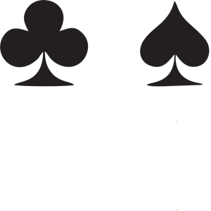
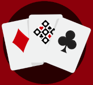

<!DOCTYPE html>
<html lang="pt-br">
<head>
    <meta charset="UTF-8">
    <meta http-equiv="X-UA-Compatible" content="IE=edge">
    <meta name="viewport" content="width=device-width, initial-scale=1.0">
    <link rel="shortcut icon" href="imagens/favicon.ico" type="image/x-icon">
    <link rel="stylesheet" href="style.css">
    <title>Truco Bot - O melhor para sua diversão!</title>
    
</head>
<body>
    <header class="cabecalho">
        
        <nav class="cabecalho-escrito">
            <a class="cabecalho-escrito-item">Comunidade</a>
            <a class="cabecalho-escrito-item">Tutorial</a>
            <a class="cabecalho-escrito-item">Open Source</a>
            <a class="cabecalho-escrito-item">Comandos</a>
        </nav>
    </header>
    <main class="conteudo">
        <section class="conteudo-principal">
            

                <h1 class="conteudo-principal-escrito-titulo">Truco Bot</h1>
                <h2 class="conteudo-principal-escrito-subtitulo">Deixe a sua comunidade mais divertida!</h2>
                <button class="conteudo-principal-escrito-botao">Me adicione!</button>
            

            
        </section>
        <section class="conteudo-secundario">
            <h3 class="conteudo-secundario-titulo">O que ele pode te oferecer?</h3>
            
1. Cria uma <strong>de divisão de cartas igualmente balanceado</strong>  para não ocorrer problemas

            
2. Um bot voltado ao seu lazer e de seus amigos, <strong>perfeito para você jogar em grupo</strong>  sem ter que sair da plataforma do discord

            
3. Modo de jogo de <strong>2, 4 ou 6 pessoas</strong>  para jogar com amigos

        </section>
    </main>
    <footer class="rodape">
        
    </footer>
</body>
</html>
